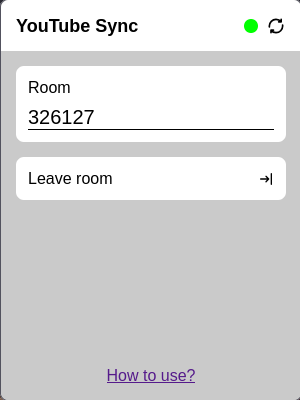

# youtube-sync-addon

Firefox web-extension for synchronous video watching on YouTube.

## Requirements
1. Mozilla Firefox (v133.0.3+)
2. NodeJs (v22.11.0+)
3. [Npm dependencies](./package.json)

## Installation
1. Clone the repository
```
git clone https://github.com/YaroslavEls/youtube-sync-addon.git
```
2. Install dependencies
```
npm install
```
3. Rename `.env.example` file to `.env` (for local usage there is no need to change anything it it).
4. Load extension to Firefox [[firefox docs](https://extensionworkshop.com/documentation/develop/temporary-installation-in-firefox/)]
    - Open Firefox
    - Enter "about:debugging" in the URL bar
    - Click "This Firefox"
    - Click "Load Temporary Add-on"
    - Open project directory and select manifest.json file.
5. Run server
```
npm start
```

## Usage
The extension only works on `youtube.com` domain. To use it, you need to be on the page with video you would like to watch (e.g. `https://www.youtube.com/watch?...`).

The interface:




- The colored circle on top right indicates the current state of the connection. Green color -> everything cool. Red color -> problems with connection.
- Button next to it is used to refresh connecting (e.g. to solve problems with it).
- On the first screen (the left image) you can either create a new room or join an existing one by entering it's id.
- After creating or joining the room, the interface will change (the right image). Here you can copy room id and share it to someone or leave the room.
- When you are in the room, YouTube video on your page will automatically be synchronized with all other members of the room.
